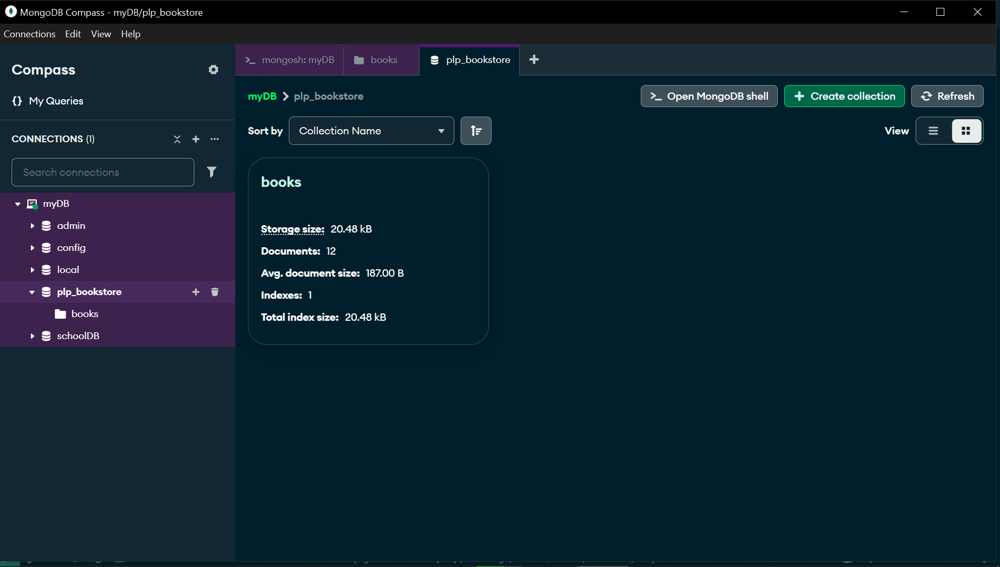
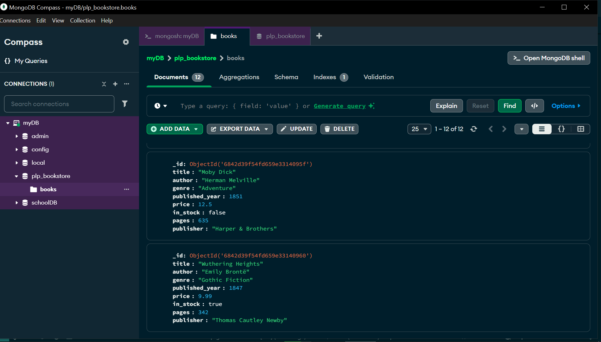
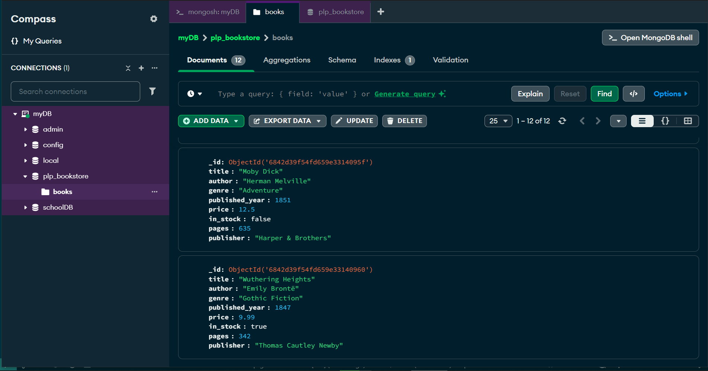

# 🗄️ Week 1: MongoDB – Data Layer Fundamentals and Advanced Techniques

## 🚀 Objective

This assignment focuses on learning the fundamentals of MongoDB, including installation, creating collections, performing CRUD operations, using aggregation pipelines, and implementing indexing for performance optimization.

---

## 📂 Tasks Overview

### ✅ Task 1: MongoDB Setup

- Installed MongoDB locally / Set up MongoDB Atlas
- Created a database called `plp_bookstore`
- Created a collection named `books`

---

### ✅ Task 2: Basic CRUD Operations

- Inserted at least 10 book documents using the `insert_books.js` script
- Each document includes fields like `title`, `author`, `genre`, `published_year`, `price`, `in_stock`, `pages`, and `publisher`
- Wrote queries to:
  - Find books by genre, year, and author
  - Update book information
  - Delete a book by title

---

### ✅ Task 3: Advanced Queries

- Queried books that meet multiple conditions
- Used projections to return specific fields
- Sorted results by book price
- Implemented pagination using `limit()` and `skip()` for 5 books per page

---

### ✅ Task 4: Aggregation Pipelines

- Calculated the average price of books grouped by genre
- Identified the author with the most books
- Grouped books by publication decade and counted them

---

### ✅ Task 5: Indexing & Performance Optimization

- Created an index on the `title` field for faster searches
- Created a compound index on `author` and `published_year`
- Used the `.explain()` method to demonstrate performance improvements with indexing

---

## 🛠️ Setup Instructions

1. Install MongoDB Community Edition or set up a MongoDB Atlas account
2. Run the `insert_books.js` script to populate the database
3. Use MongoDB Shell (`mongosh`) or MongoDB Compass to interact with the database
4. Save all MongoDB queries in a file named `queries.js`

---

## 📸 Screenshot

### A screenshot of the collection

### A screenshot of the documents

### A screenshot of the documents

---

**All tasks completed successfully.**
